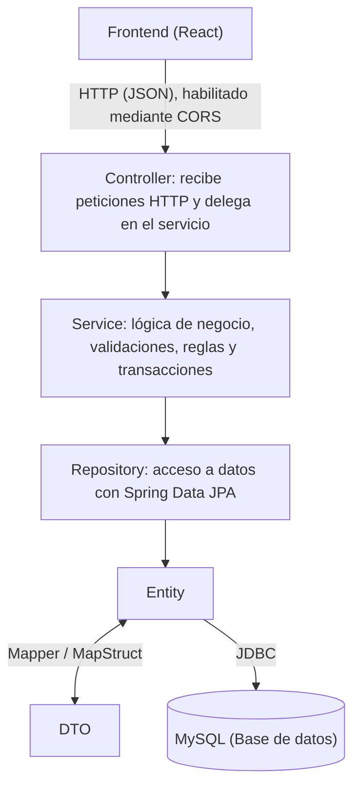

# Laboratorio 1 – Introducción a Spring Boot

**Curso:** Arquitectura de Software.  
**Programa:** Ingeniería de Sistemas – Universidad de Antioquia.  
**Docente:** Diego José Luis Botia Valderrama.  
**Periodo:** 2026-2

**Estudiantes:**
- Santiago Sepúlveda Rojas <[santiago.sepulveda4@udea.edu.co](santiago.sepulveda4@udea.edu.co)>.
- Mateo Upegui Borja <[mateo.upeguib@udea.edu.co](mailto:mateo.upeguib@udea.edu.co)>.

---

https://github.com/user-attachments/assets/709ae614-6952-4740-92fc-2efc91b7c894

---

## 1. Introducción

En el marco del curso de Arquitectura de Software, este laboratorio tuvo como propósito introducir el desarrollo de aplicaciones empresariales bajo el ecosistema **Spring Boot**, aplicando una arquitectura por capas que separa claramente las responsabilidades del sistema (presentación, lógica de negocio, acceso a datos y modelo de dominio).

Para ello se construyó el backend de una aplicación bancaria simplificada, capaz de gestionar clientes, realizar transferencias de dinero entre cuentas y consultar el histórico de transacciones, exponiendo dicha funcionalidad a través de una API REST. Complementariamente, se desarrolló un frontend en React que consume estos servicios, cerrando así el ciclo completo cliente-servidor propio de una aplicación web moderna.

Este informe documenta el proceso de configuración del entorno de desarrollo, la arquitectura implementada, el procedimiento seguido durante la construcción de la solución y las conclusiones obtenidas a partir de la experiencia práctica.

---

## 2. Objetivos

### 2.1. Objetivo general

Diseñar e implementar una aplicación web bancaria utilizando el framework Spring Boot, aplicando los principios de una arquitectura por capas y los patrones de diseño asociados al desarrollo de APIs REST empresariales.

### 2.2. Objetivos específicos

- Configurar un entorno de desarrollo completo para aplicaciones Java empresariales (JDK, IDE, gestor de dependencias y motor de base de datos).
- Implementar una arquitectura por capas (Entidad, DTO, Mapper, Repositorio, Servicio y Controlador) que favorezca la mantenibilidad y el desacoplamiento del sistema.
- Aplicar **Spring Data JPA** para la persistencia de datos, delegando en el framework la generación de las operaciones CRUD básicas contra la base de datos MySQL.
- Utilizar **MapStruct** para automatizar la conversión entre entidades del dominio y objetos de transferencia de datos (DTOs), evitando el mapeo manual y reduciendo el código repetitivo.
- Garantizar la integridad de las operaciones críticas del negocio (transferencias entre cuentas) mediante el manejo de transacciones (`@Transactional`).
- Diseñar e implementar los endpoints REST necesarios para la gestión de clientes y transacciones, verificando su correcto funcionamiento mediante Postman.
- Construir un frontend en React que consuma la API desarrollada, permitiendo al usuario final consultar clientes, realizar transferencias y visualizar el historial de transacciones.

---

## 3. Herramientas de Software Empleadas

| Herramienta | Versión utilizada | Propósito |
|---|---|---|
| JDK (Eclipse Temurin) | 17.0.20 (LTS) | Entorno de ejecución y compilación de Java |
| IntelliJ IDEA Community Edition | 2025.2+ | IDE principal para el desarrollo del backend |
| Apache Maven | 3.9.16 | Gestión de dependencias y ciclo de vida del proyecto |
| Spring Boot | 4.0.8 | Framework principal de la aplicación backend |
| Spring Data JPA / Hibernate | 7.2.24.Final | Persistencia y mapeo objeto-relacional (ORM) |
| MySQL Server | 8.0.46 | Motor de base de datos relacional |
| MySQL Workbench | 8.0.47 | Administración visual de la base de datos |
| Lombok | 1.18.44 | Reducción de código repetitivo (getters, setters, constructores) |
| MapStruct | 1.5.5.Final | Generación automática de mappers Entity ↔ DTO |
| Postman | — | Pruebas manuales de los endpoints REST |
| Node.js | 24.16.0 | Entorno de ejecución de JavaScript para el frontend |
| React + Vite | 19.x | Librería y herramienta de build para el frontend |
| Axios | — | Cliente HTTP para el consumo de la API desde el frontend |
| Git / GitHub | — | Control de versiones y alojamiento del repositorio |

---

## 4. Arquitectura Propuesta

La solución se estructuró siguiendo una **arquitectura por capas (layered architecture)**, uno de los estilos arquitectónicos más utilizados en el desarrollo de aplicaciones empresariales, ya que favorece la separación de responsabilidades y facilita el mantenimiento y las pruebas del sistema.

De forma general, el flujo de una petición a través del sistema es el siguiente:

**Capas implementadas:**

- **Entity:** clases anotadas con `@Entity` que representan el modelo de dominio y se mapean directamente a las tablas de la base de datos (`Customer`, `Transaction`).
- **DTO (Data Transfer Object):** objetos livianos utilizados para exponer únicamente la información necesaria a través de la API, evitando acoplar la representación externa al modelo interno de persistencia.
- **Mapper:** interfaces implementadas automáticamente por MapStruct en tiempo de compilación, encargadas de traducir entre entidades y DTOs sin necesidad de escribir ese código manualmente.
- **Repository:** interfaces que extienden `JpaRepository`, a través de las cuales Spring Data JPA genera automáticamente las operaciones de acceso a datos.
- **Service:** contiene la lógica de negocio propiamente dicha, como la validación de cuentas, el control de saldo suficiente y la ejecución de las transferencias dentro de una transacción atómica.
- **Controller:** expone los endpoints REST y traduce las peticiones/respuestas HTTP hacia y desde la capa de servicio.

Adicionalmente, se configuró un **filtro CORS** en el backend para permitir que el frontend, servido desde un origen distinto (`localhost:5173`), pudiera consumir la API sin ser bloqueado por las políticas de seguridad del navegador.

El frontend, por su parte, se estructuró como una aplicación independiente en React, consumiendo la API mediante peticiones HTTP mínimas necesarias para cubrir las tres vistas solicitadas: consulta de clientes, transferencia de dinero entre cuentas y consulta del histórico de transacciones por cliente.

---

## 5. Procedimiento

1. **Configuración del entorno de desarrollo:** instalación y configuración de JDK 17 (Eclipse Temurin), IntelliJ IDEA Community Edition, Apache Maven, MySQL Server y MySQL Workbench, verificando la correcta coexistencia de estas herramientas con versiones previamente instaladas en el sistema.

2. **Creación del proyecto Spring Boot:** generación del proyecto base mediante Spring Initializr, incluyendo las dependencias de Spring Web, Spring Data JPA, MySQL Driver, Lombok y Spring Boot DevTools, e incorporando posteriormente MapStruct para el mapeo automático de DTOs.

3. **Configuración de la base de datos:** creación de la base de datos `lab1v2026banco` en MySQL y configuración de la cadena de conexión JDBC en `application.properties`, habilitando la generación automática del esquema mediante `spring.jpa.hibernate.ddl-auto=update`.

4. **Implementación de la capa de modelo:** definición de las entidades `Customer` y `Transaction` con sus respectivas anotaciones JPA, y de los DTOs correspondientes para el intercambio de información con el cliente.

5. **Implementación de mappers con MapStruct:** creación de las interfaces `CustomerMapper` y `TransactionMapper`, delegando en MapStruct la generación de la lógica de conversión entre entidades y DTOs.

6. **Implementación de repositorios:** definición de `CustomerRepository` y `TransactionRepository` extendiendo `JpaRepository`, incluyendo métodos de consulta personalizados como `findByAccountNumber`.

7. **Implementación de la lógica de negocio:** desarrollo de `CustomerService` y `TransactionService`, incorporando las validaciones necesarias (cuentas existentes, saldo suficiente) y garantizando la atomicidad de las transferencias mediante `@Transactional`.

8. **Implementación de los controladores REST:** definición de `CustomerController` y `TransactionController`, exponiendo los siguientes endpoints:

   | Método | Endpoint | Descripción |
         |---|---|---|
   | GET | `/api/customers` | Obtener todos los clientes |
   | GET | `/api/customers/{id}` | Obtener un cliente por ID |
   | POST | `/api/customers` | Crear un nuevo cliente |
   | POST | `/api/transactions` | Realizar una transferencia entre cuentas |
   | GET | `/api/transactions/{accountNumber}` | Consultar el histórico de transacciones de una cuenta |

9. **Configuración de CORS:** implementación de una clase de configuración (`CorsConfig`) que habilita las peticiones desde el origen del frontend.

10. **Pruebas de la API con Postman:** verificación funcional de cada endpoint, incluyendo la creación de clientes, la ejecución de transferencias y la consulta del histórico de transacciones, corrigiendo a lo largo del proceso distintos errores de configuración (resolución de dependencias en Maven, dialecto de Hibernate, generación del timestamp en las transacciones, entre otros).

11. **Desarrollo del frontend:** inicialización del proyecto con Vite + React, instalación de Axios como cliente HTTP, y construcción de las vistas necesarias para consumir la API: consulta de clientes, formulario de transferencia de dinero y tabla de histórico de transacciones.

12. **Documentación del proyecto:** elaboración del presente informe y organización del repositorio en GitHub, incluyendo el código fuente de backend y frontend.

---

## 6. Conclusiones

- La arquitectura por capas facilita considerablemente el mantenimiento y la escalabilidad de una aplicación, ya que cada capa tiene una responsabilidad claramente delimitada: el controlador no conoce detalles de persistencia, y el repositorio no conoce nada sobre HTTP.
- Herramientas como **Spring Data JPA** reducen drásticamente la cantidad de código necesario para el acceso a datos, permitiendo declarar únicamente el contrato (la interfaz) y delegando en el framework la implementación de las operaciones CRUD.
- El uso de **DTOs junto con MapStruct** demostró ser una práctica valiosa para desacoplar el modelo de dominio de lo que efectivamente se expone a través de la API, evitando además el código repetitivo propio del mapeo manual entre objetos.
- El manejo explícito de **transacciones** (`@Transactional`) resultó fundamental en operaciones que involucran múltiples escrituras relacionadas entre sí, como una transferencia bancaria, donde una falla parcial podría dejar la información en un estado inconsistente.
- La configuración del entorno (JDK, Maven, MySQL) reveló la importancia de comprender cómo cada herramienta resuelve sus dependencias (PATH vs. variables de entorno como `JAVA_HOME`), especialmente al convivir múltiples versiones en un mismo sistema.
- La separación entre backend y frontend como aplicaciones independientes, comunicadas mediante una API REST y sujetas a las políticas de CORS del navegador, reflejó de forma práctica un patrón de arquitectura ampliamente utilizado en el desarrollo web actual.

---

## 7. Bibliografía

- Spring. (2026). *Spring Boot Reference Documentation*. https://docs.spring.io/spring-boot/index.html
- Spring. (2026). *Spring Data JPA Reference Documentation*. https://docs.spring.io/spring-data/jpa/reference/
- MapStruct. (2026). *MapStruct Reference Guide*. https://mapstruct.org/documentation/
- Project Lombok. (2026). *Lombok Features*. https://projectlombok.org/features/
- Oracle Corporation. (2026). *MySQL 8.0 Reference Manual*. https://dev.mysql.com/doc/refman/8.0/en/
- Postman. (2026). *Postman Learning Center*. https://learning.postman.com/
- React. (2026). *React Documentation*. https://react.dev/
- Vite. (2026). *Vite Guide*. https://vite.dev/guide/